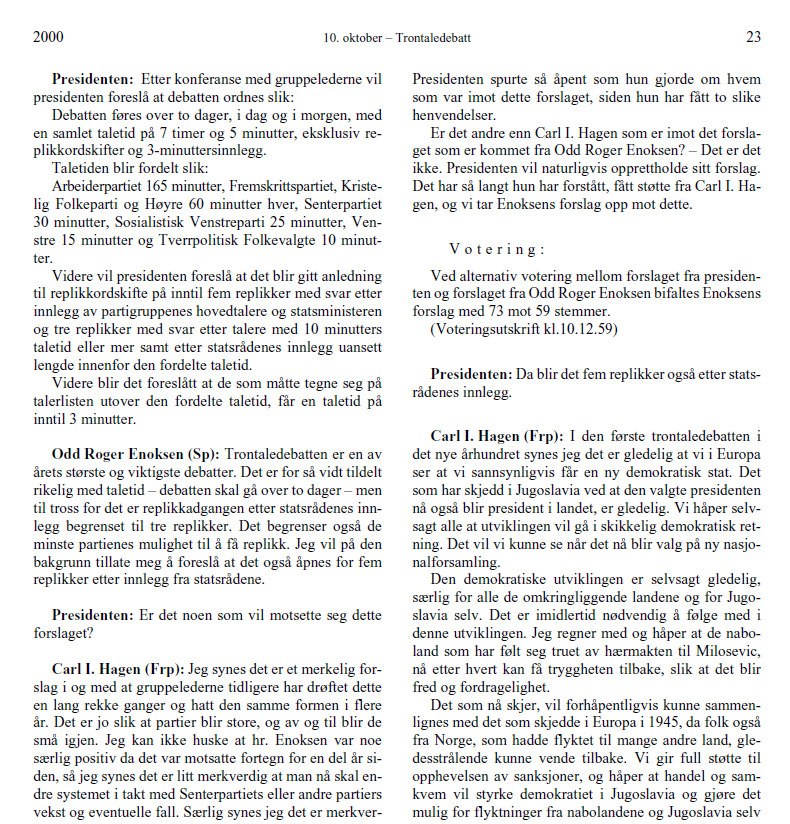
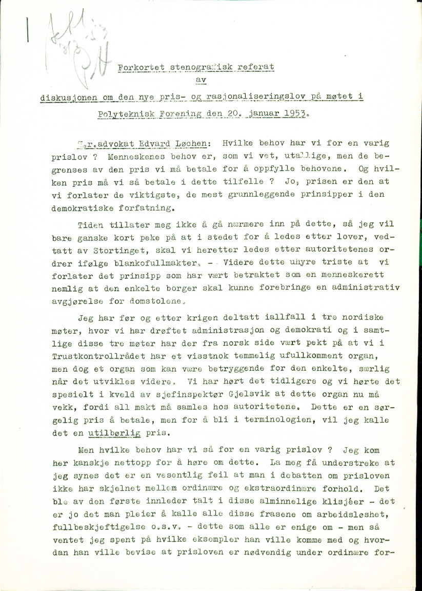
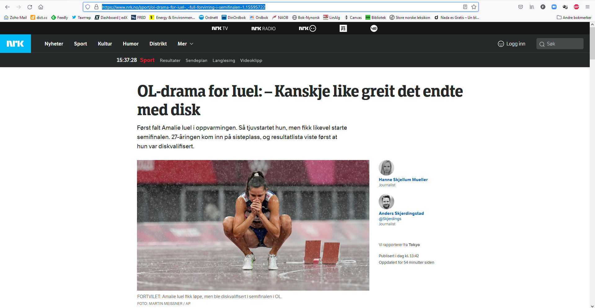

```{r klippy, echo=FALSE, include=TRUE}
klippy::klippy(position = c('top', 'right'))
```

```{r setup, include=FALSE} 
knitr::opts_chunk$set(warning = FALSE, message = FALSE) 
```

We'll need the following libraries for this session

```{r}
library(readtext)
library(tidyverse)
library(tabulizer)
```

The Charles Dickens novels can be downloaded [here](data/docs/A Christmas Carol - Charles Dickens - 1843.pdf), [here](data/docs/David Copperfield - Charles Dickens - 1850.txt), [here](data/docs/Hard Times - Charles Dickens - 1854.docx), and [here](data/docs/Oliver Twist - Charles Dickens - 1838.html).

# Reading in Documents

We'd be nowhere without documents! And getting them into R is no trivial task. The first question to ask is, what is the format of the documents I want to read into R? 

## Reading in txt, doc or pdf files

Historians are interested in old books and there are a lot of old books freely accessible on the web already digitized (and some of them even cleaned). For an example, I've gone to [Project Gutenberg](https://www.gutenberg.org/) and downloaded four Charles Dickens novels. To demonstrate a point, I have saved them in four different formats: Word, pdf, txt, html and saved them (links just above) with the file names "[Novel_name] - [Author] - [Year]".

Now let's take a look at what is in that folder. I've also saved some files as Word and PDF files. 

```{r}
(books_list <- list.files(path = "data/docs", full.names = TRUE))
```

``readtext`` is a handy R package that will automatically decide what sort of file it is, read it in, AND will help us out with variables associated with the document. 

```{r}
books <- readtext(books_list)
# Notice this will save as a readtext object. Let's convert to our tidyverse's format for dataframes, called a tibble.
books <- as_tibble(books)
```

Notice that it has read these texts into R and we now have them all in a dataframe - one column is a ``doc_id`` and the other is the text. There is no metadata (document variables). ``readtext`` allows us to import variables automatically from file names (assuming we have informative file names, which, as it _just so happens_, we do). As an aside, we could do similar things with the help of the tidyverse and a function called [``separate``](https://tidyr.tidyverse.org/reference/separate.html), but we'll just use ``readtext`` here. 

```{r}
books <- readtext(books_list, docvarsfrom="filenames", dvsep = ' - ', docvarnames = c('Title', 'Author', 'Year')) %>%
  as_tibble()
books
```

And we now can save this to a file for easy access next time we work on it. There are multiple ways to do this, one is to save as a csv file.

```{r, eval = FALSE}
write_csv(books, "data/dickens_books.csv")
```


It might be worthwhile mentioning that there is an R [package](https://cran.r-project.org/web/packages/gutenbergr/vignettes/intro.html) for accessing Project Gutenberg that you would actually want to use that would be easier than downloading things by hand. 


## PDFs that use columns or other different text layouts

``readtext`` and a similar R package called ``pdftools`` are great but they get flummoxed by weird text layouts, including kinds you find quite often in official state documents.

```{r, echo=FALSE, fig.align="center", fig.cap = "Sample page of Storting proceedings. Bundestag proceedings, and doubtlessly many more, are formatted the same way."}

```

``readtext`` is going to have a hard time with that. You can try it yourself but it's going to read from left to right across columns, rather than the left column first then the right. 

As of a couple of years ago one had to get really creative and cut the pdfs up and then sew them back together (there might still be times when you want to do this, see the [``magick``](https://docs.ropensci.org/magick/articles/intro.html) package) but now we have an R package that is quite smart about this called ``tabulizer``. The package has java dependencies that might create huge problems in Windows. Another option is to use Rstudio's quite cool cloud service at https://rstudio.cloud. We can upload documents there, install the packages we need on then download the resulting dataframe we build there. 

Let's take a historical [Stortings melding](data/stmeld8_kongo.pdf). The front page looks like this.

```{r, echo=FALSE, fig.align="center", fig.cap = "Clear machine-readable text but in columns."}
knitr::include_graphics("data/st_meld.jpg")
```

Hmm, multi-column format. First we might try ``readtext`` and print out the first 1000 characters to see how things look. Save the pdf somewhere you'll know where to access it (I've saved midne in the "data" folder in my working drive).

```{r}
df<- readtext('data/stmeld8_kongo.pdf')
str_sub(df$text, 1, 1000) # if we print out in cat() we see that the spacing is preserved from the original pdf
```

It looks like we've read in a bunch of text, and we have. But if we look a bit closer, we see that the first sentence of the document in the pdf reads: "Den 30. juni 1960 ble tidligere Belgisk Kongo proklamert som selvstendig stat." But ``readtext`` ignores the column space and has: "Den 30. juni 1960 ble tidligere Belgisk Kongo     Samtidig med dette brøt Katanga-provinsen\\nproklamert som selvstendig stat." And we see the whitespace that is actually the column break. There are actually methods we're going to use that will throw out word order and this sort of thing wouldn't matter. But not always by any means. 

The tabulizer package is just as easy. Tabulizer can be problematic to install because of Java dependencies but run either from your own PC or from the RStudio cloud, it gives a much better result for no extra work. 

```{r}
file <- 'data/stmeld8_kongo.pdf'
numpages <- get_n_pages(file) 
text <- extract_text(file, encoding = 'UTF-8', pages=1:numpages) # this will return a vector of one character string per page. Take the pages option out of the call and we get one collapsed character string for the whole document. 
```

Finally, tabulizer is an incredibly powerful package. If you have tables you'd like to read from pdfs, as economic historians very well might, I highly recommend tabulizer's very cool ``extract_areas()`` function. Say we have a page like below and we'd like to extract just the table from Statoil's 2001 [Sustainability Report](https://www.equinor.com/sustainability/sustainability-reports-archive) ([direct link](data/sustainability-report-2001-equinor.pdf)).

```{r, echo=FALSE, fig.align="center", fig.cap = "Page 44 of Statoil's 2001 Sustainability Report."}
knitr::include_graphics("data/statoilSRExample.jpg")
```

We can do this interactively with tabulizer. We can call ``extract_areas()`` and then highlight the part of the page where the table is located telling tabulizer where to extract the table data from.

```{r, eval = FALSE}
extract_areas("data/sustainability-report-2001-equinor.pdf", 44)
```

If you have numerous documents with tables at the same place you can also specify location to have ``tabulizer`` do this over numerous documents. Powerful stuff.

## Reading in non-machine readable PDFs (hardest and probably most likely for historians)

Perhaps the documents we historians are most likely to want to analyze are hand-scanned archival documents. These we might have as pictures (jgp or gif or tiff formats perhaps) or pdf files on our local machine. To make these digitally analyzable we'll need to use optical character recognition (OCR) technology. This is a rapidly progressing frontier of machine learning and the technology is constantly getting better. Humans are still far better at reading and recognizing text than computers but the gap is steadily shrinking and might one day in the future disappear. For now though, we'll have to deal with less than perfection.

R has "bindings" (packages that give access to) tessaract, which is an open source Google OCR project. Below is an example using pdftools to do this from .pdf (see the Tessaract [vignette](https://cran.r-project.org/web/packages/tesseract/vignettes/intro.html) for an example of how to do this for .jpg files using the R package ``magick``.)

The way OCR works is that the algorithms are made to "learn" by ingesting a large amount of data for which the right answers are known (ie. images of text that have been, perfectly, digitized). The algorithms trained to recognize English are included in the package, anything else has to be downloaded by hand as shown below (to find you needed language's three letter code, see the [tessdata](https://github.com/tesseract-ocr/tessdata) github repository and especially the list of available languages [here](https://tesseract-ocr.github.io/tessdoc/Data-Files-in-different-versions.html)). 

Here is an example from my archive photos, a document form the Norwegian Riksarkivet in Oslo. 

```{r, echo=FALSE, out.width="50%"}

```

Tesseract takes in a file in an image format so if we have a PDF we'll need to convert it to an image format (well use .png here) first. We'll use the package ``pdftools`` to do this. Let's first find a document to practice on. All the defaults in Tesseract are English so this is generally fairly straightforward. Other languages are more challenging so we'll do a Norwegian example. 

We'll take the King's opening speech to the Stortinget in 1925. If we got to historical documents on the Stortinget's [https://www.stortinget.no/no/Saker-og-publikasjoner/Stortingsforhandlinger/#historiske-dokumenter](webpage), go to "Publikasjonstitler", 1925 and search for "Hans Majestet Kongens tale til det 74de ordentlige Storting ved dets åpning" (or just "hans majastet" will probably work to). Download the speech, preferably with a helpful title such as "Storting_KongHaakon_1925.pdf" or something of the sort.

```{r, eval = FALSE}
norsk <- tesseract(language='nor') #before doing this you will need to have run: tesseract_download('nor')
png_archivedoc <- pdftools::pdf_convert("./data/Storting_KongHaakon_1925.pdf", dpi = 600)
text <- ocr(png_archivedoc, engine=norsk)
```

First, it needs to be cleaned up, which we'll be turning to momentarily. Even cleaned it's not perfect. But not half bad.

# Cleaning up text

As we've seen already, almost always when documents in the real world are read into R they are highly imperfect. They will have all kinds of crazy tags, whitespaces (which also show up as tags under some viewing methods), and other things we may want to strip. In fact, in the real world collecting and cleaning data generally takes at least as long as analysis. A fairly balanced workshop on text analysis would probably rightly spend at least half of its time on these issues and less on analytics. We'll get on to analytics in the next section but it's important to realize that these initial ones are just as important, even if they seem a little dull and uninspiring.

We'll use two sample corpora as examples and test corpora for the rest of the workshop. The first is Nobel Peace Prize award ceremony speeches since 1905. They are scraped from https://www.nobelprize.org using a slightly more advanced methods than we'll discuss here. For code and brief discussion, see the [Appendix](#Appendix). The second is a corpus of Sustainability Reports for several major international oil companies. 

The nobel corpus saved as csv is [here](data/NobelPeace.csv) and the oil company sustainability reports [here](data/srps.csv). First let's read them into R.

```{r, message = FALSE}
nobel <- read_csv("data/NobelPeace.csv", locale=locale(encoding = "UTF-8"))
nobnsr <- read_csv("data/srps.csv")
```

## Viewing your tibble corpus

So after the first two sessions we're assuming we have our corpus in a tibble, with one column being the text of the documents and other columns of metadata -- year and company for the Social Responsibility reports, laureate and year for our Nobel Peace Prize award speeches. First things first, there are numerous ways to try to get an overview of the data. If you just enter the dataframe's name in R you will get the first few lines. Alternately, you can use ``print()`` -- tibbles are [built](https://tibble.tidyverse.org/reference/formatting.html) to make printing and viewing dataframes easier. If we want to print all rows (you have to be careful with this, if you have millions of rows this will probably crash R) we can do this.

```{r}
nobel # note that this tells you the datatype of each column
print(nobel, n = Inf)
```

Other options are ``glimpse()`` (tidyverse) and ``str()`` (baseR) that give you different ways to visualize a bit. Often the easiest is to ask R to open a separate window with ``View()``. Finally, sometimes if you have a long character string the easiest way to inspect it is simply to print it out separately. Using the ``cat()`` command will format using the formatting tags in the text -- it will look nicer but you might want to know where the /n and /t tags (newline and tab markers) are.

```{r}
#View(nobel) # opens a new window
nobel$AwardSpeech[4] # will show the fourth line of the text column of the nobel dataframe
cat(nobel$AwardSpeech[4]) # nicer formatting but now you're not seeing formatting tags in the text
```

## White spaces, urls, tags, etc.

As noted, we might well want to strip artefacts of the scanning and importing process so we only have the text itself. Looking at our ``nobel$AwardSpeech[1]`` call above we see some \t's, \n's, \r's. These are [escape characters](https://en.wikipedia.org/wiki/Escape_character). To see what they do:

```{r}
test <- "     Here \n there \t\t\t and \n\n\reverywhere.\n"
print(test)
cat(test)
```

There are also things like ``\u0092`` that are charcter encodings that have gotten garbled -- this one representing an apostrophe. We also might want to look for where there is more than one space and replace it with one, remove white space at the beginning... and so on. We can use stringr's ``str_replace_all`` to do all this and utilize our knowledge of regular expressions (the stringr [documentation](https://stringr.tidyverse.org/) and cheatsheet are especially helpful).

```{r}
# Practice on our small test string
test <- "     Here \n there and \t\t\t everywhere.\n         "
test_clean <- str_replace_all(test, "[(\\n)(\\r)(\\t)]", ' ')
test_clean <- str_replace_all(test_clean, " {2,}", " ")
test_clean <- str_replace_all(test_clean, "^ *| *$", "")
test_clean
```

That removed all those spacing encodings and whitespace. But it won't be any surprise to you anymore that the tidyverse actually makes this much easier for us.

```{r}
str_squish(test) 
```

So that was simple. Now the unicode encodings from the Nobel speeches.

```{r}
speech <- nobel$AwardSpeech[1]
str_replace_all(speech, "\u0092", "'")
```

```{r}
speech %>%
  str_replace_all("\u0092", "'") %>%
  str_replace_all("(\u0093)|(\u0094)", "'") %>%
  str_replace_all("[0-9]\\.", ".") %>%
  str_squish() %>%
  str_to_lower()
```

(Backslashes, especially, are confusing. For a quick refresher on regex in R, take a look at the quick tidyverse [overview](https://stringr.tidyverse.org/articles/regular-expressions.html#escaping).)

That looks pretty clean just as text. For most of our text analysis we're actually going to remove all punctuation, but there is an argument to be made for getting as clean an original text as you can to start out with. Now that we know how to use ``stringr`` and regular expressions, we can easily strip out all punctuation. (some of the packages we will be using will also do this automatically for us as well)

Let's do that to the whole nobel corpus. We can either write a loop (seen as less good) or use the tidyverse (better).

```{r}
# for (i in 1:dim(nobel)[1]){
#   nobel['AwardSpeech'][i,] <- nobel['AwardSpeech'][i,] %>%
#     str_replace_all("\u0092", "'") %>%
#     str_replace_all("(\u0093)|(\u0094)", '"') %>%
#     str_squish()
#}

#OR

(nobel <- nobel %>%
  mutate(clean_text = str_replace_all(AwardSpeech, "\u0092", "'")) %>%
  mutate(clean_text = str_replace_all(clean_text, "(\u0093)|(\u0094)", '"')) %>%
  mutate(clean_text = str_to_lower(clean_text)) %>%
  mutate(clean_text = str_squish(clean_text)))
```

We can compare AwardSpeech with text columns, ``nobel$clean_text`` does indeed look cleaner.

```{r}
nobel <- nobel %>%
  select(Year, Laureate, clean_text) %>%
  rename(Year = Year, Laureate = Laureate, AwardSpeech = clean_text)  # renaming cols
write_rds(nobel, "data/nobel_cleaned.Rds")
```

More information on regular expressions:
- https://www.princeton.edu/~mlovett/reference/Regular-Expressions.pdf
- @wickham2016r, chapter 14.

## Excercises

- Look at other excess text in the Nobel corpus. How can we write code to cut these pieces out?
- Are the problems the same with the SR report corpus? Take a look and see if we can run the same code or we need to do different things to clean that corpus.


# Manipulating dataframes

At this point there is actually a fair amount we can do with our corpus as a dataframe and text corpus in one column. To help us manipulate dataframes, let's take a quick look at the tidyverse's system of manipulation by common-sense verbs.

With ``nobel`` we have a dataframe of speeches from 1905 to 2019 (with some holes where there was no prize given out). How do we subset this dataframe so we have only speeches from 1950-1980? Use filter.

```{r}
nobel %>%
  filter(Year >= 1950 & Year <= 1980)
```

Here we've said to filter the corpus based on rows where Year is greater or equal to 1950 and less than or equal to 1980. & is the "and" operator, | is "or", and ! is not. 

```{r, eval = FALSE}
nobel %>%
  filter(Year == 1950 | Year == 1980) # returns rows for 1950 and 1980
nobel %>%
  filter(Year >= 1950 & Year <= 1954 & Year != 1953) # returns rows >= 1950, <=1954 and not 1953
```

``mutate`` adds new columns. Say we'd like a column telling us whether the year was before WWII or after.

```{r}
nobel %>%
  mutate(after_WWII = Year > 1945)
```

One thing I often do is use ``mutate`` to do word counts of every document row, essentially by counting all clusters of words or numbers that are separated by spaces on either side.

```{r}
nobel <- nobel %>%
  mutate(wc = str_count(AwardSpeech, '[\\w]+'))
```

And now we can finally start doing some analysis! Right now you will note that if we want to plot the length of award speeches over time, we have a Year column that could be an x-axis variable and a word count column as y-axis. This sounds tidy to me.

```{r}
nobel %>%
  ggplot(aes(x = Year, y = wc)) +
  geom_line() # just line graph, we might add geom_point() to underscore that we have missing years
```

Tidy offers us the handy ``summarize`` command to summarize. First, can we sum all the word counts to get a total word count for our entire Nobel corpus? And average word count?

```{r}
nobel %>%
  summarize(average = sum(wc))
nobel %>%
  summarize(average = mean(wc))
```

Where summarize really shines though is if we have groups. Let's split our corpus up by decade and then we'll get average word counts by decade using the ``group_by`` function.

```{r}
nobel %>%
  mutate(decade = (Year %/% 10) * 10) %>% # uses something called modulo division to get the decade
  group_by(decade) %>%
  summarize(mean(wc))
```

``summarize`` also has a ``n()`` function that can be helpful telling us how many observations per group we have. There were alot of years without a Nobel Peace Prize so this might be interesting to look at.

```{r}
nobel %>%
  mutate(decade = (Year %/% 10) * 10) %>% 
  group_by(decade) %>%
  summarize(n())
```

As we spoke about in the workshop, another way we could think to divide up the time periods is periods prior to the Cold War, the Cold War, and after. This we can do with the tidy command ``case_when``.
```{r}
nobel %>%
  mutate(period = case_when(
    Year <= 1945 ~ "Pre-cold war",
    Year > 1945 & Year <= 1991 ~ "Cold War",
    Year > 1991 ~ "Post-cold war",
  )) %>%
  group_by(period) %>%
  summarize(mean(wc))
```

This also gives us all the tools we need to do google-style n-gram plots (there are many ways to do this of course). We count the number of words in the texts, group by year, and then plot.

```{r}
nobel %>%
  mutate(peace = str_count(AwardSpeech, "[Pp]eace")) %>%
  mutate(war = str_count(AwardSpeech, "[Ww]ar")) %>%
  mutate(humright = str_count(AwardSpeech, "[Hh]uman [Rr]ights")) %>%
  group_by(Year) %>%
  summarize(peace = sum(peace), war = sum(war), human_rights = sum(humright)) %>%
  pivot_longer(c("peace", "war", "human_rights"), names_to = "word", values_to = "counts") %>%
  ggplot(aes(x = Year, y = counts, color = word)) +
    geom_line()
```


## Excercises
- Make other n-grams of your choice of the Nobel corpus. Anything surprising?
- Using the SR corpus, find total word count of the corpus, graph word counts by company over time, and plot out n-grams of words of your choice.
- Chart n-grams over time per company with the SR corpus.

# Appendix

## Web scraping

Web scraping is a huge and often quite complicated topic that one would rightfully want to dedicate an entire workshop, possibly much longer than 2 days, to. Given that this is a large and rich potential source of text for historians, we look at just the _very_ basics here.

Say we'd like to scrape stories from nrk.no. Let's just pick a random [one](https://www.nrk.no/sport/ol-drama-for-iuel-_-full-forvirring-i-semifinalen-1.15595722).

```{r, echo=FALSE, fig.align="center", fig.cap = "Top story on nrk.no when I was preparing this presentation"}

```

We'll use a library called ``rvest``. We'll first call the library, enter the url and use ``read_html`` to download the data from that url.

```{r}
library(rvest)
url <- "https://www.nrk.no/sport/ol-drama-for-iuel-_-full-forvirring-i-semifinalen-1.15595722"
nrk <- read_html(url)
nrk
```

So we have it? Well, kind of. We have "it" but we also have a whole lot more. There's a lot of information on this page, much of which we don't need or want to collect. The menus, the other related stories, and so on. Plus, what we get with R is not just what we see but a whole ton of tags and definitions that are intended for our browsers, not for us. We maybe want the text, headline, author, and the date. So how do we get this information, no more no less?

We'll need to go into the actual HTML code and find the information and then tell R where to get it. Luckily this is a bit easier than it sounds. In your web browser go to the menu button -> More tools -> Web Developer Tools.

You'll get a panel of web developer tools. On the top menu line of the panel is an icon (circled in the image below) for selecting an element in the page.

```{r, echo=FALSE, fig.align="center", fig.cap = "This will look slightly different in different browsers."}
knitr::include_graphics("data/nrk_tools.jpg")
```

With this selected, you now want to find the parts of the page you want to extract. When you go to the journalists' names and hover over with your mouse, you will see a box above with ``a.author__name`` written in it. That's the html tag telling the browser how to display the author's names and that's what we'll tell R to extract.

```{r}
authors <- nrk %>%
  html_elements('a.author__name') %>%
  html_text()
authors
```

We do the same with the thing with the headline, date and text (it might take some experimentation to get this right).

```{r}

headline <- nrk %>%
  html_elements('h1.title.title-large.article-title') %>%
    html_text()

text <- nrk %>%
  html_elements('div.lp_articlebody.text-body.text-body-sans-serif.container-widget-content.nostack.cf') %>%
  html_text()
text
```

The date is a little bit trickier (as is the sub-headline). First of all, for me, looking at it the day of, the date is just "i dag". That's not too helpful for posterity. But it's not just that, it's within a ``span`` class that's not going to recognize for various and sundry reasons anyway (you can try it). But if we click on the date and then look in the developer tools panel below (or on the side if its Chrome) it will show us that this span class is itself embedded in a a time tag (one line up from the span with the date-time) which in turn has a date-time. When we hover over this line we now see a box over the date with 'time.datetime-absolute.datePublished' written. Let's see if this works. 

```{r, warnings=FALSE}
library(lubridate)
date <- nrk %>%
  html_element('time.datetime-absolute.datePublished') %>%
  html_text()
date
```

This has it, but more than we want. We have some "\n" which is code to create a new line on the page. There might well be a way to fine tune our html_element() parameters with ``rvest`` to get it to extract just the information we want but we can also do this with other R tools. We'll use [``stringr``](https://stringr.tidyverse.org/) (yet another member of the tidyverse). ``stringr`` is a package to search ad manipulate character strings. What we need is something that will extract just the date from the above character string ``time``. To do this we'll think back and remember the tutorial on regular expressions. We'll extract the portion of the string that matches the DDDD-DD-DD pattern, where D are digits.

```{r, warnings = FALSE}
library(stringr)

date <- date %>%
  str_extract(pattern = "[0-9]{2}.[0-9]{2}.[0-9]{4}") %>% # should be //.
  dmy()

```

So we've now extracted all the information we want. We can put it all together in a dataframe now.

```{r, message=FALSE}
library(tidyverse)
(article <- tibble(Author = authors, Date = date, Headline = headline, Text = text))
```

Note in true tidy form its creating two rows of this dataframe, two "observations", one for each journalist. We got this because we had two authors and they were in a vector of two items (each name). To condense we could concatenate them into one object.

```{r}
(authors <- str_c(authors, collapse = ", ")) # also from stringer, concatenates multiple character objects into one
(article <- tibble(Author = authors, Date = date, Headline = headline, Text = text))
```

### Links to more information

As noted, this is just the barest of introductions. I wanted, however, to at least go through the basics because it's a rich source of possible texts for historians. As of just a few years ago if you wanted to do sophisticated web scraping you really had to turn to Python. And Python perhaps still has the edge, particularly with a library called BeautifulSoup.^[A good, thorough introduction for those interested is @mitchell2018web.] But packages in R have come a long way in the last couple years and you can now do pretty sophisticated scraping in R as well. I attach a few links that will help you get started if you are so interested.

- https://rvest.tidyverse.org/articles/harvesting-the-web.html
- https://towardsdatascience.com/tidy-web-scraping-in-r-tutorial-and-resources-ac9f72b4fe47
- https://github.com/yusuzech/r-web-scraping-cheat-sheet/blob/master/README.md
- https://www.scrapingbee.com/blog/web-scraping-r/


## More scraping (more advanced)

Back when we were scraping stories from the NRK website, we scraped one story. But probably what we'd really like to do is build up a _corpus_ of texts, not just one article but numerous. You could just do the above by hand and have a tibble for every article and then combine multiple tibbles to get one large tibble that had your whole corpus. But there is a much better way and one that will introduce a basic concept of programming called a "for loop". 

Assume we want to scrape a bunch of NRK stories. We can put the urls in a vector in R.

```{r}
articles <- c("https://www.nrk.no/sport/grovdal-fullstendig-parkert-i-ol-finalen_-_-det-er-rett-og-slett-litt-vondt-a-se-pa-1.15595563", "https://www.nrk.no/sport/vant-heat-etter-fall-i-siste-runde_-_-umenneskelig-1.15595067", "https://www.nrk.no/vestland/hemmelig-plan-for-statsraad-lehmkuhl_-sommerskuta-dukket-plutselig-opp-i-bergen-1.15595488", "https://www.nrk.no/osloogviken/tiltalt-for-forsettlig-drap-pa-christian-halvorsen-1.15595796") # a random list of the top stories on NRK at the time of writing. Saving as character objects so remember to put the urls in quotes

```

I now have a list of urls and for each item of this list I want to do the same thing. So we will "loop" through this list doing what we just did for the one NRK article to each of the objects of this list. Here is the syntax. 

```{r}
corpus <- tibble()  # creating an empty tibble to copy everything into
for (url in articles){ # looping over our list of 4 urls
  nrk <- read_html(url) 
  authors <- nrk %>%
    html_elements('a.author__name') %>%
    html_text()
  authors <- str_c(authors[[1]], collapse = ", ") # also from stringer, concatenates multiple character objects into one
  headline <- nrk %>%
    html_elements('h1.title.title-large.article-title') %>%
    html_text()
  text <- nrk %>%
    html_elements('div.lp_articlebody.text-body.text-body-sans-serif.container-widget-content.nostack.cf') %>%
    html_text()
  date <- nrk %>%
    html_element('time.datetime-absolute.datePublished') %>%
    html_text() %>%
    str_extract(pattern = "[0-9]{2}.[0-9]{2}.[0-9]{2}") %>%
    dmy()
  article <- tibble(Author = authors, Date = date, Headline = headline, Text = text, URL = url)
  corpus <- rbind(corpus, article) # rbind stands for "row bind". We copy the rows of our new article dataframe to the old corpus dataframe which at the end of the for loop will give us a dataframe called corpus with all the data from our four articles
  }
```

In words, we are telling R: "Hey R, I have a vector (i.e. a list) called ``articles``. I want you to go into this vector and look at each object individually. We're going to call these objects ``url`` (note we could call them anything at all, this is just name. Often objects in for lists are called i, sometimes x, etc.) For each individual object in my vector, do what is written in the curly braces (all the steps we went through to scrape one article").  

## Scraping the nobel speeches

If we google "nobel prize ceremony speech", we land on a page that looks like [this](https://www.nobelprize.org/prizes/peace/2018/ceremony-speech/). We note that we can navigate to ceremony speeches of other years but this takes a lot of clicking. It's going to take a lot of work to program a bot to do this. BUT! If we look at the url we see that it's standardized with a year. What if we try the same thing with 2017? It gives us exactly the page we want. In fact, it does so for any year since the very earliest years of the prize. (Incidentally, navigating by links on the cite I have trouble accessing them before the 1960s.) This makes it very easy to generate a list of links.

```{r}
# https://www.nobelprize.org/prizes/peace/1905/ceremony-speech/   This is the link that we need to replicate changing the year for each year between 1905 and 2019. We'll start in 1905 as before that it's not really the speech but something less, we want to compare apples to apples as much as possible
library(rvest)
## https://www.nobelprize.org/prizes/peace/1905/ceremony-speech/
urls <- vector()
for (i in 1905:2019){
  new_url <- paste0("https://www.nobelprize.org/prizes/peace/", i, "/ceremony-speech/")
  urls <- append(urls, new_url)
  }
```

But not all these links exist because the Nobel wasn't given out in all years. If we try to open those years (try, for instance, https://www.nobelprize.org/prizes/peace/1915/ceremony-speech/) There are several ways we could deal with this, we could write down years it wasn't given out and remove them from our list of possible urls. But the other thing we can do is use a "try block" within our loop that tells R precisely that: try this, but if it doesn't work, just got on to the next object in the loop. We're going to do this, and then scrape the page in a similar way to which we scraped nrk.no in the last unit. We're going to be a bit more particular about what we edit out because we want only the the text of the speeches as much as possible, not the additional information (citation info, informational footers, etc) that the site gives us.

```{r, eval = FALSE}
corp <- tibble()
for (url_address in urls){
  try(
  {
    nobel <- read_html(url_address)
    text <- nobel %>%
      html_elements('article.page-content.border-top.entry-content') %>%
      html_elements('p') %>%
      html_text() %>%
      tibble()
    footer <- nobel %>%
      html_elements("footer") %>%
      html_elements('p') %>%
      html_text() %>%
      tibble()
    small_text <- nobel %>%
      html_elements("p.smalltext") %>%
      html_text() %>%
      tibble() %>%
      drop_na()
    copy_text <- nobel %>%
      html_elements("p.copy") %>%
      html_text() %>%
      tibble() %>%
      drop_na()
    remove_text <- rbind(footer, small_text, copy_text)
    remove <- vector()
    for (i in 1:dim(remove_text)[1]){
      for (j in 1:dim(text)[1]){
        if (text[j,] == remove_text[i,]){
        remove <- c(remove, j)
      }
    }
    }
    text <- text[-remove, ]
    total_text <- ''
      for (i in 1:dim(text)[1]) {
        total_text <- paste(total_text, str_c(text[i,1]))
        }
    laureate <- nobel %>%
      html_elements('li.list-laureate') %>%
      html_text() %>%
      str_trim() # trims white space before and after
    laureate <- str_c(laureate, collapse = ", ") # also from stringer, concatenates multiple character objects into one
    year <- str_extract(url_address, "[0-9]{4}")
    temp_tibble <- tibble(Year = year, Laureate = laureate, AwardSpeech = total_text)
    temp_tibble
    corp <- rbind(corp, temp_tibble)
}
  )
}

write.csv(corp, "NobelPeace.csv")
```


# References
